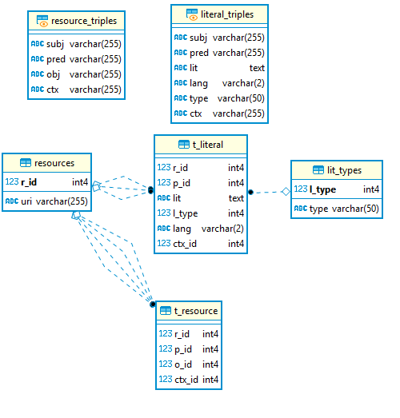

# PyHarvest
Extremely naive harverter.  The key element is the postgresql database that manages resources in such a way that unique URI are kept in a seperate tables and only a reference (id) refers to it.  

## Data model

Unique resources are stored in resources table and given a unique id.
Statements which the object are stored in `t_resource` and is therefore just a collections of id (subject,predicate,object,context).
Statements which the object is a literal are kept in `t_literal` and stores different aspect of the literal : it's value, its type and its language.
The literal types are manages in `lit_type`, only the id of that type is stored in `t_literal`

Two views ; `resource_triples` and `literal_triples` merge back the resources ids and their values.
Those views are also used to insert triples. The views have INSTEAD OF triggers that does the house keeping of create a new resources if it does not already exists in `resources` table.  The trigger on `literal_triples`also takes care of this job for literal types - if any. NULL type is just a string.
 
 ## Example code
 
 `main.py` shows an simple example of inserting triples into the database
